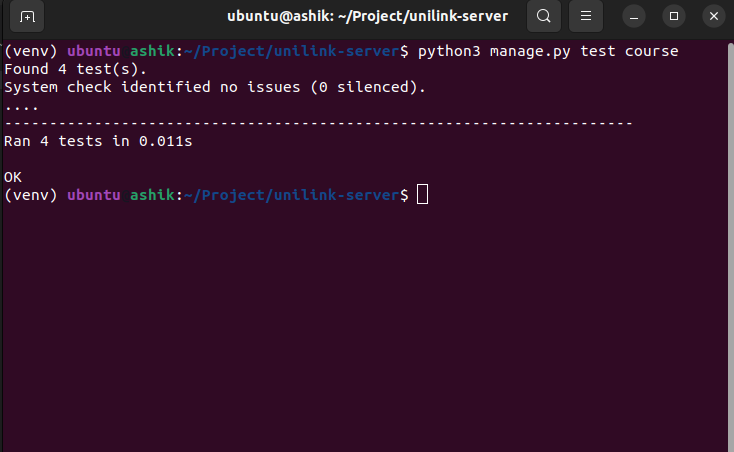
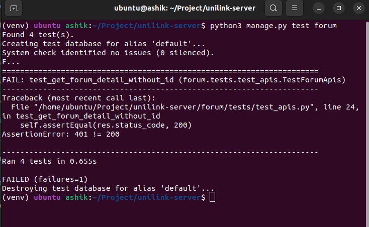
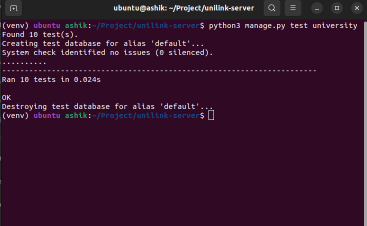

# Testing

## Chat 

**Testing Code**

    from rest_framework.test import APITestCase, APIClient
    from rest_framework import status
    from unittest.mock import patch
    from django.urls import reverse, resolve
    from rest_framework.authtoken.models import Token
    from django.test import SimpleTestCase
    from university.views import *

    from university.models import University 
    from university.serializers import UniversitySerializer
    from users.permissions import SiteAdminOnly
    from users.models import UserAccount
    from users.permissions import SiteAdminOnly
    from users.models import UserType
    import pdb

    class TestCreateUni(APITestCase):
        def setUp(self):
            self.url = reverse('create-university')

            self.create_uni_data = {
                "doc_url" : "Test url",
                "code": 1,
                "name": "Test Uni",
                "domain": "uni",
                "admin": {
                    "first_name": "mr",
                    "last_name": "x",
                    "username": "uniadmin",
                    "email": "mdashik560@outlook.com"
                }
            }
        
        
        def test_create_uni_with_no_data(self):
            response = self.client.post(self.url)
            self.assertEqual(response.status_code, 400)
        
        def test_create_uni_with_data(self):
            response = self.client.post(self.url,self.create_uni_data,format="json")     
            self.assertEqual(response.status_code, 200)

    class TestApproveUni(APITestCase):

        def setUp(self):
            self.url = reverse('approved-university-list-public')

        def test_approve_university_list_public(self):
            response = self.client.get(self.url);
            self.assertEqual(response.status_code, 200)
            
            
    class UniversityUrlsTests(SimpleTestCase):

        
        def test_pending_university_list_resolved(self):
            url = reverse('pending-university-list')
            self.assertEquals(resolve(url).func, pending_university_list)
        
        def test_approved_university_list_resolved(self):
            url = reverse('approved-university-list')
            self.assertEquals(resolve(url).func, approved_university_list)
        
        def test_approved_university_list_public_resolved(self):
            url = reverse('approved-university-list-public')
            self.assertEquals(resolve(url).func, approved_university_list_public)
        
        def test_approve_university_resolved(self):
            url = reverse('approve-university')
            self.assertEquals(resolve(url).func, approve_university)
        
        def test_disapprove_university_resolved(self):
            url = reverse('disapprove-university')
            self.assertEquals(resolve(url).func, disapprove_university)
        
        def test_ban_university_resolved(self):
            url = reverse('ban-university')
            self.assertEquals(resolve(url).func, ban_university)
        
        def test_unban_university_resolved(self):
            url = reverse('unban-university')
            self.assertEquals(resolve(url).func, unban_university)

**Output**

## Course 

**Testing Code**

    from django.test import SimpleTestCase, Client
    from django.urls import reverse, resolve
    from course.views import *

    class TestChatUrls(SimpleTestCase):

        def test_get_course_resolved(self):
            url = reverse('get_courses')
            self.assertEquals(resolve(url).func, get_courses)

        def test_create_dourse_resolved(self):
            url = reverse('create_course')
            self.assertEquals(resolve(url).func, create_course)

        def test_delete_dourse_resolved(self):
            url = reverse('delete_course')
            self.assertEquals(resolve(url).func, delete_course)

        def test_get_section_resolved(self):
            url = reverse('get_section')
            self.assertEquals(resolve(url).func, get_section)

**Output**

## Forum 

**Testing Code**

    from django.test import SimpleTestCase, Client
    from rest_framework.test import APITestCase, APIClient
    from rest_framework import status
    from django.urls import reverse, resolve
    from forum.views import *
    import pdb

    from django.contrib.auth import get_user_model
    from users.models import UserAccount

    class TestForumApis(APITestCase):
        def setUp(self):
            self.client = Client()
            self.user = UserAccount.objects.create_user(username='testuser', password='testpassword', email='test@gamil.com')

            self.client.login(username='testuser', password='testpassword')
        
        def test_get_forum_detail_without_id(self):
            url = reverse('forum-detail')
            data = {
                'id':1,
            }
            res = self.client.get(url,data,format="json")
            self.assertEqual(res.status_code, 200)

    class TestForumUrls(SimpleTestCase):
        def test_forum_detail_resolved(self):
            url = reverse('forum-detail')
            self.assertEquals(resolve(url).func, get_forum_by_id)
        
        def test_forum_category_resolved(self):
            url = reverse('forum-category-list')
            self.assertEquals(resolve(url).func, forum_category_list)
        
        def test_forum_post_list_resolved(self):
            url = reverse('forum-post-list')
            self.assertEquals(resolve(url).func, forum_post_list)
    
    
**Output**

## Univeristy

**Testing Code**

        from rest_framework.test import APITestCase, APIClient
        from rest_framework import status
        from unittest.mock import patch
        from django.urls import reverse, resolve
        from rest_framework.authtoken.models import Token
        from django.test import SimpleTestCase
        from university.views import *

        from university.models import University 
        from university.serializers import UniversitySerializer
        from users.permissions import SiteAdminOnly
        from users.models import UserAccount
        from users.permissions import SiteAdminOnly
        from users.models import UserType
        import pdb

        class TestCreateUni(APITestCase):
            def setUp(self):
                self.url = reverse('create-university')

                self.create_uni_data = {
                    "doc_url" : "Test url",
                    "code": 1,
                    "name": "Test Uni",
                    "domain": "uni",
                    "admin": {
                        "first_name": "mr",
                        "last_name": "x",
                        "username": "uniadmin",
                        "email": "mdashik560@outlook.com"
                    }
                }
            
            
            def test_create_uni_with_no_data(self):
                response = self.client.post(self.url)
                self.assertEqual(response.status_code, 400)
            
            def test_create_uni_with_data(self):
                response = self.client.post(self.url,self.create_uni_data,format="json")     
                self.assertEqual(response.status_code, 200)

        class TestApproveUni(APITestCase):

            def setUp(self):
                self.url = reverse('approved-university-list-public')

            def test_approve_university_list_public(self):
                response = self.client.get(self.url);
                self.assertEqual(response.status_code, 200)
                
                
        class UniversityUrlsTests(SimpleTestCase):

            
            def test_pending_university_list_resolved(self):
                url = reverse('pending-university-list')
                self.assertEquals(resolve(url).func, pending_university_list)
            
            def test_approved_university_list_resolved(self):
                url = reverse('approved-university-list')
                self.assertEquals(resolve(url).func, approved_university_list)
            
            def test_approved_university_list_public_resolved(self):
                url = reverse('approved-university-list-public')
                self.assertEquals(resolve(url).func, approved_university_list_public)
            
            def test_approve_university_resolved(self):
                url = reverse('approve-university')
                self.assertEquals(resolve(url).func, approve_university)
            
            def test_disapprove_university_resolved(self):
                url = reverse('disapprove-university')
                self.assertEquals(resolve(url).func, disapprove_university)
            
            def test_ban_university_resolved(self):
                url = reverse('ban-university')
                self.assertEquals(resolve(url).func, ban_university)
            
            def test_unban_university_resolved(self):
                url = reverse('unban-university')
                self.assertEquals(resolve(url).func, unban_university)

**Output**

